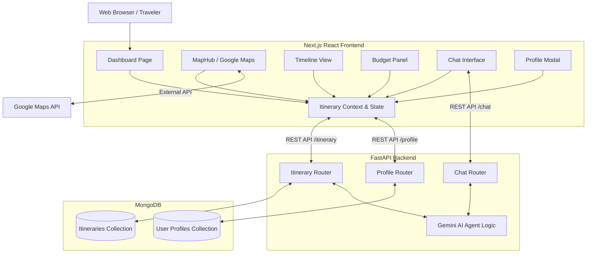

# Architecture Overview

This document outlines the high-level architecture of the **My Travel AIgent** application. It details the interactions between the client-side Next.js frontend, the FastAPI Python backend, the Gemini AI Agent, and the MongoDB database.

## High-Level Architecture Diagram

## Core Components

### 1. Frontend (Next.js / React)
* **ItineraryContext:** Acts as the single source of truth for the application's state, managing the active itinerary, traveler profile, and global view mode (Total vs. Per Person).
* **Visual Planning Dashboard:** Provides a drag-and-drop chronological timeline (`TimelineView`), dynamic budgeting constraints (`BudgetPanel`), and a geographic workspace (`MapHub`).
* **Chat Interface:** Connects directly to the Gemini Agent to iteratively build and refine the travel plans via natural language.

### 2. Backend (FastAPI / Python)
* **Routers:** Modular endpoints mapping to Profiles (`/profile`), Itineraries (`/itinerary`), and Chat (`/chat`).
* **Pydantic Models:** Validates incoming payloads strictly against schemas like `TravelerProfile`, `Event`, and `Itinerary`.

### 3. AI Agent (Gemini)
* Resolves user intents, performs logic routing, handles schedule constraints, calculates transit buffers, and returns strictly typed JSON data back to the application.

### 4. Database (MongoDB)
* Stores documents utilizing `Motor` (Async MongoDB driver). Ensures that users can retrieve and sync asynchronous trip data or their global constraints independently.