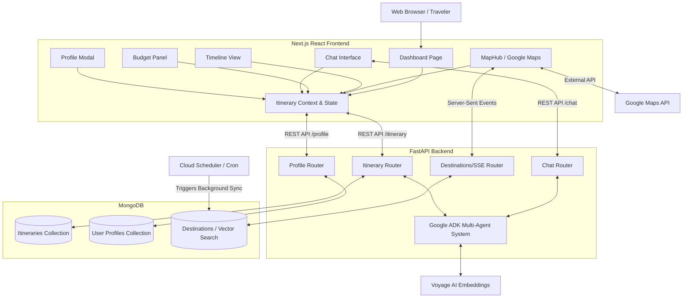

# Architecture Overview

This document outlines the high-level architecture of the **My Travel AIgent** application. It details the interactions between the client-side Next.js frontend, the FastAPI Python backend, the Gemini AI Agent, and the MongoDB database.

## High-Level Architecture Diagram

## Core Components

### 1. Frontend (Next.js / React)
* **ItineraryContext:** Acts as the single source of truth for the application's state, managing the active itinerary, traveler profile, and global view mode (Total vs. Per Person).
* **Visual Planning Dashboard:** Provides a drag-and-drop chronological timeline (`TimelineView`), dynamic budgeting constraints (`BudgetPanel`), and a geographic workspace (`MapHub`).
* **Chat Interface:** Connects directly to the Gemini Agent to iteratively build and refine the travel plans via natural language.

### 2. Backend (FastAPI / Python)
* **Routers:** Modular endpoints mapping to Profiles (`/profile`), Itineraries (`/itinerary`), and Chat (`/chat`).
* **Pydantic Models:** Validates incoming payloads strictly against schemas like `TravelerProfile`, `Event`, and `Itinerary`.

### 3. AI Agent (Gemini)
* Resolves user intents, performs logic routing, handles schedule constraints, calculates transit buffers, and returns strictly typed JSON data back to the application.

### 4. Database (MongoDB)
* Stores documents utilizing `Motor` (Async MongoDB driver). Ensures that users can retrieve and sync asynchronous trip data or their global constraints independently.

## Real-Time State Flow (Server-Sent Events)

To provide a seamless, non-blocking user experience, the application uses **Server-Sent Events (SSE)** to sync the backend AI's asynchronous discovery process with the frontend state.

1. **Trigger:** The user selects a destination on the map. The frontend optimistically updates the `ItineraryContext` and opens a persistent SSE connection via `GET /destinations/{name}/stream`.
2. **Background Processing:** The AI Agents (or background cron jobs) asynchronously query Google Places and Voyage AI to discover localized lodgings and activities, saving the newly discovered results to the MongoDB `destinations` collection.
3. **Push Updates:** The FastAPI backend monitors the database document for that destination. The moment it detects a change, it streams the updated JSON payload down the open SSE connection.
4. **State Reconciliation:** The `MapHub` component receives the event, parses the new suggestions, and instantly populates the map markers and suggestion windows without requiring the user to refresh or the frontend to aggressively poll the API.